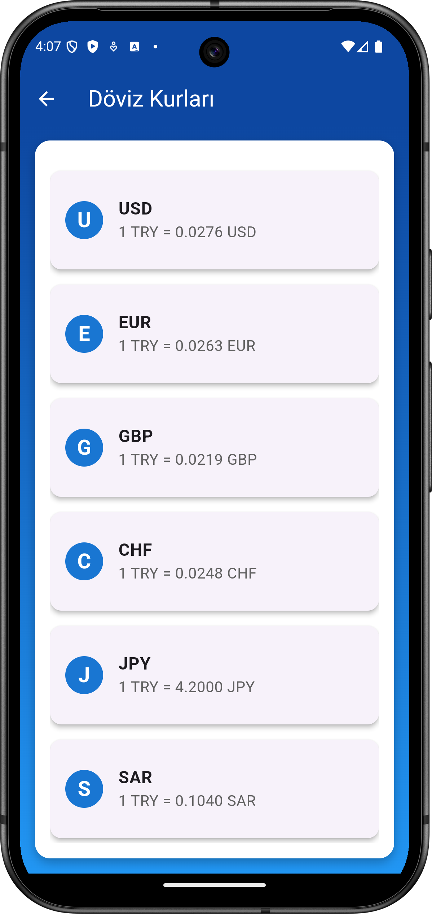
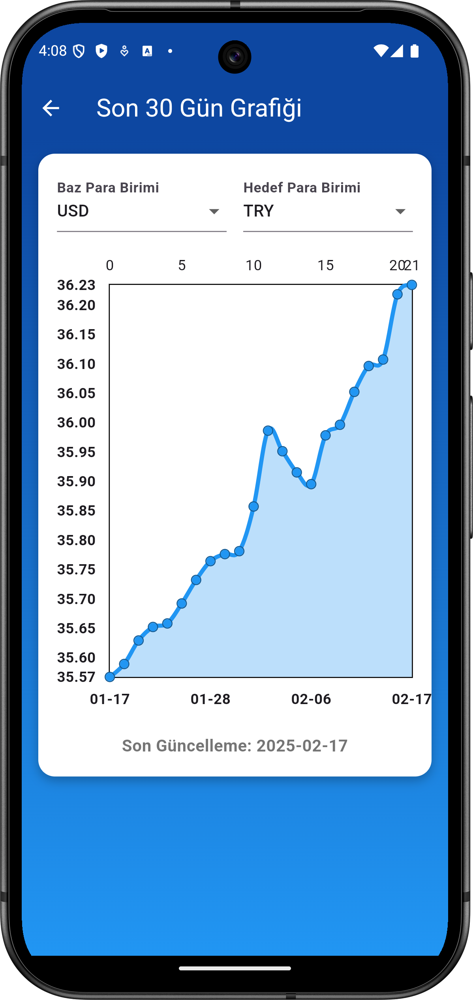
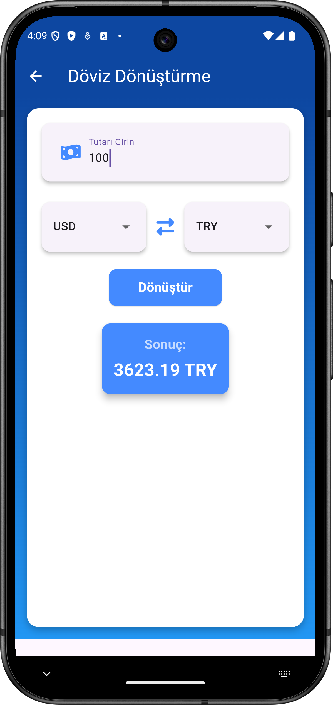

# 🚀 Currency Tracker

Currency Tracker, Flutter ile geliştirilmiş **döviz takip uygulamasıdır**. Uygulama üç ana özelliğe sahiptir: **güncel döviz kurları**, **geçmiş 30 günlük döviz kuru grafiği** ve **döviz çevirici**.

## 🌟 Özellikler

✅ **Splash Ekranı**: Uygulamaya şık bir giriş yapmanızı sağlar.  
✅ **Güncel Döviz Kurları**: Popüler dövizlerin **Türk Lirası** karşısındaki güncel değerlerini görüntüleyin.  
✅ **30 Günlük Döviz Kuru Grafiği**: Seçtiğiniz iki para biriminin **son 30 gündeki değişimini** grafik üzerinde inceleyin.  
✅ **Döviz Çevirici**: Seçtiğiniz para birimleri arasında **hızlı ve kolay dönüşüm** yapın.  

## 📸 Ekran Görüntüleri

🌟 **Lottie Animasyonlu Splash Ekranı**  


🏠 **Ana Sayfa**  


📊 **Güncel Kurlar**  


📈 **Döviz Grafiği**  


🔄 **Döviz Çevirici**  


## 🛠 Kullanılan Teknolojiler & Kütüphaneler

- 🎯 **Flutter (Dart)** – Modern ve güçlü bir UI framework'ü
- 🔄 **Provider** – State management için
- 🌐 **http** – API istekleri için
- 📊 **fl_chart** – Grafik ve veri görselleştirme için
- 🔍 **exchangerate.host API** – Güncel ve geçmiş döviz kurları için

## 🚀 Kurulum & Çalıştırma

1️⃣ Bu depoyu klonlayın:  
   ```bash
   git clone https://github.com/yourusername/currency-tracker.git
   cd currency-tracker
   ```
2️⃣ Bağımlılıkları yükleyin:  
   ```bash
   flutter pub get
   ```
3️⃣ Uygulamayı çalıştırın:  
   ```bash
   flutter run
   ```

## 🔧 API Konfigürasyonu

Uygulama, döviz kurlarını **exchangerate.host API** üzerinden çeker. **API anahtarı gerekmez** 🚀
